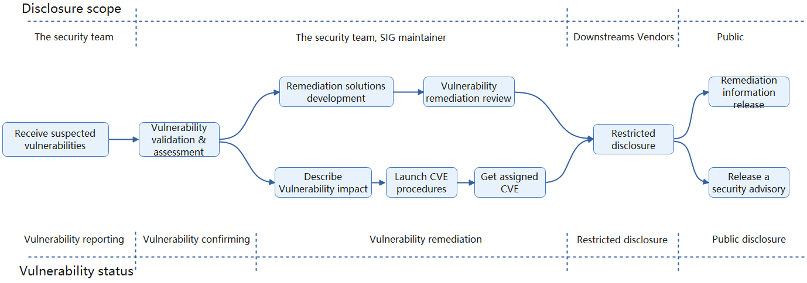

# Security Policy

# Security Policy outline

## Table of contents

- [Reporting a vulnerability](#reporting-a-vulnerability)
- [Vulnerability handling process](#vulnerability-handling-process)
- [Review process](#review-process)
- [Mailing lists](#mailing-lists)
- [Disclosures](#disclosures)
  - [Private disclosure processes](#private-disclosure-processes)
  - [Public disclosure processes](#public-disclosure-processes)
  - [Embargo policy](#embargo-policy)
- [Supported versions](#supported-versions)
- [Joining the security announce mailing list](#joining-the-security-announce-mailing-list)
  - [Request to join](#request-to-join)
  - [Membership criteria](#membership-criteria)

## Reporting a vulnerability

To report a vulnerability, please contact the Security Team: [cncf-kubeedge-security@lists.cncf.io](mailto:cncf-kubeedge-security@lists.cncf.io). You can email the Security Team with the security details and the details expected for [KubeEdge bug reports](https://github.com/kubeedge/kubeedge/blob/master/.github/ISSUE_TEMPLATE/bug-report.md). Security is of the highest importance and we sincerely request you to keep the vulnerability information confidential.

The team will help diagnose the severity of the issue and determine how to address the issue. The reporter(s) can expect a response within 24 hours acknowledging the issue was received. If a response is not received within 24 hours, please reach out to any Security Team member directly to confirm receipt of the issue.

## Vulnerability handling process

Here is an overview of the vulnerability handling process, we will strictly handle the reporting vulnerability  according to this procedure.

## Review process

After receiving any suspected vulnerability, the Security Team will discuss the issue with the reporter(s) and KubeEdge's security advisors to analyze/validate the vulnerability, assess its severity based on its actual impact on KubeEdge.

If the vulnerability is accepted, its remediation priority, and develop remediations (including mitigations, patches/versions, and other risk mitigations) will be determined.

Sticking to the principles of harm and risk reduction, we release vulnerability information to stakeholders through the [cncf-kubeedge-distrib-announce@lists.cncf.io](mailto:cncf-kubeedge-distrib-announce@lists.cncf.io) mailing list. The reporter(s) are expected to participate in the discussion of the timeline and abide by agreed upon dates for public disclosure. 

## Mailing lists

- [cncf-kubeedge-security@lists.cncf.io](mailto:cncf-kubeedge-security@lists.cncf.io), is for reporting security concerns to the KubeEdge Security Team, who uses the list to privately discuss security issues and fixes prior to disclosure.
- [cncf-kubeedge-distrib-announce@lists.cncf.io](mailto:cncf-kubeedge-distrib-announce@lists.cncf.io), is for early private information and vulnerability disclosure. See the [section](#Joining the security announce mailing list) below for information on how KubeEdge distributors or vendors can apply to join this list.

## Disclosures

### Private disclosure processes

First we will disclose to the distributors through the [cncf-kubeedge-distrib-announce@lists.cncf.io](mailto:cncf-kubeedge-distrib-announce@lists.cncf.io) mailing list, at least 7 days before the planned public disclosure date. 

The notification will include all information that can be reasonably provided at the time of the notification. This may include patches or links to PRs, proofs of concept or instructions to reproduce the vulnerability, known mitigations, and timelines for public disclosure. 

### Public disclosure processes

Then publish it publicly, the release period is usually 1-21 days after receiving the report.
- Distributor will be notified 24 hours in advance of the public release.
- The Security Team will announce the new releases, severity, and impact, and the location of the binaries to get wide distribution and mitigation measures.
- The announcement will be sent via the following channels:
  - [GitHub Security Advisories](https://github.com/kubeedge/kubeedge/security/advisories)
  - [#announcement slack channel](https://kubeedge.slack.com/archives/CUABZBD55)

### Embargo policy

Members of the security [cncf-kubeedge-distrib-announce@lists.cncf.io](mailto:cncf-kubeedge-distrib-announce@lists.cncf.io) mailing list must share list information only within their teams, on a need-to-know basis to get the related issue fixed in their distribution. The information members and others receive from the list must not be made public, shared, nor even hinted at otherwise, except with the list's explicit approval. This holds true until the public disclosure date/time that was agreed upon by the list.

Before any information from the list is shared with respective members of your team required to fix an issue, they must agree to the same terms and only find out information on a need-to-know basis.

In the unfortunate event you share the information beyond what is allowed by this policy, you *must* urgently inform [the Security Team](mailto:cncf-kubeedge-security@lists.cncf.io) of exactly what information leaked and to whom, as well as the steps that will be taken to prevent future leaks.

Repeated offenses may lead to the removal from the distributors list.

## Supported versions

See the [KubeEdge releases page](https://github.com/kubeedge/kubeedge/releases) for information on supported versions of KubeEdge. Once the fix is confirmed, the Security Team will patch the vulnerability in the next patch or minor release, and backport a patch release into the latest three minor releases.

The release of low to medium severity bug fixes will include the fix details in the patch release notes. Any public announcements sent for these fixes will be linked to the release notes.

## Joining the security announce mailing list

This list is used to provide actionable information to multiple distribution vendors at once. This list is not intended for individuals to find out about security issues.

### Request to join

To join the mailing list, please send new membership requests to [the Security Team](mailto:cncf-kubeedge-security@lists.cncf.io), in the body of your request please specify how you qualify for membership and fulfill each criterion listed in the Membership Criteria section below.

### Membership criteria

To be eligible for the [cncf-kubeedge-distrib-announce@lists.cncf.io](mailto:cncf-kubeedge-distrib-announce@lists.cncf.io) mailing list, your distribution should:
1. Have an actively monitored security email alias for our project.
2. Have a user base not limited to your own organization.
3. Have a publicly verifiable track record up to present day of fixing security issues.
4. Not be a downstream or rebuild of another distribution.
5. Be a participant and active contributor in the KubeEdge community.
6. Accept the Embargo Policy that is outlined above.
7. Be willing to contribute back.
8. Have someone already on the list vouch for the person requesting membership on behalf of your distribution.

**Removal**: If your distribution stops meeting one or more of these criteria after joining the list then you will be unsubscribed.

